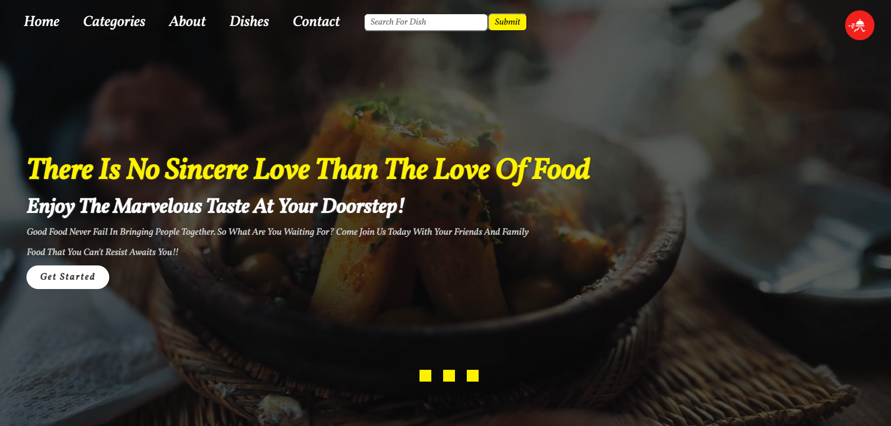
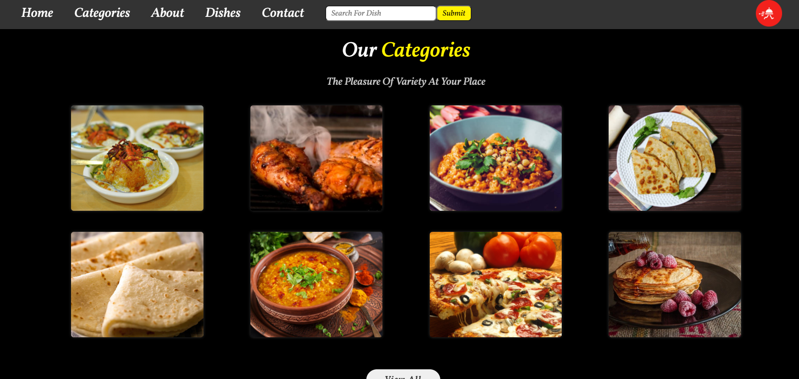

# FoodEdgy
Online Food Ordering Management System Mini-Project. This is a Web based Application developed using PHP as a Host Language.Anybody can create an account and order online.

# Screenshots





# Technologies Used
* PHP
* SQL
* Bootstrap
* Jquery

# System Requirements
Software : XAMPP / Wamp / Mamp/ Lamp (anyone).

# Installation
Just create new database in phpmyadmin and import SQL file ```food_ordering.sql```. Also configure the ```constants.php``` in ```admin/config``` folder to set up the necessary connections with the database.

# Complete project
Hosting Url : https://foodedgy.000webhostapp.com/

More features are yet to be developed and implemented. Till then, Happy Coding :)
